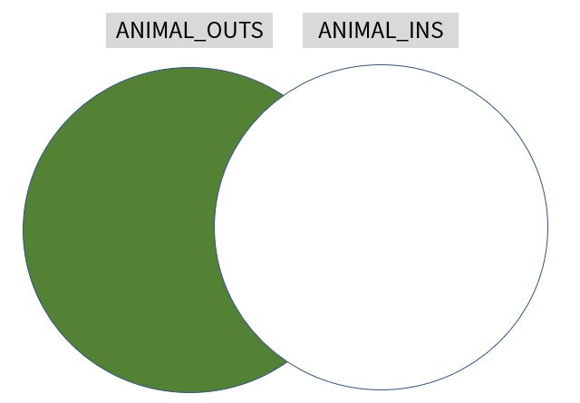

# 없어진 기록 찾기


## 문제 설명

`ANIMAL_INS` 테이블은 동물 보호소에 들어온 동물의 정보를 담은 테이블입니다. `ANIMAL_INS` 테이블 구조는 다음과 같으며, `ANIMAL_ID`, `ANIMAL_TYPE`, `DATETIME`, `INTAKE_CONDITION`, `NAME`, `SEX_UPON_INTAKE`는 각각 동물의 아이디, 생물 종, 보호 시작일, 보호 시작 시 상태, 이름, 성별 및 중성화 여부를 나타냅니다.


| NAME             | TYPE       | NULLABLE |
| ---------------- | ---------- | -------- |
| ANIMAL_ID        | VARCHAR(N) | FALSE    |
| ANIMAL_TYPE      | VARCHAR(N) | FALSE    |
| DATETIME         | DATETIME   | FALSE    |
| INTAKE_CONDITION | VARCHAR(N) | FALSE    |
| NAME             | VARCHAR(N) | TRUE     |
| SEX_UPON_INTAKE  | VARCHAR(N) | FALSE    |


`ANIMAL_OUTS` 테이블은 동물 보호소에서 입양 보낸 동물의 정보를 담은 테이블입니다. `ANIMAL_OUTS` 테이블 구조는 다음과 같으며, `ANIMAL_ID`, `ANIMAL_TYPE`, `DATETIME`, `NAME`, `SEX_UPON_OUTCOME`는 각각 동물의 아이디, 생물 종, 입양일, 이름, 성별 및 중성화 여부를 나타냅니다. `ANIMAL_OUTS` 테이블의 `ANIMAL_ID`는 `ANIMAL_INS`의 `ANIMAL_ID`의 외래 키입니다.


| NAME             | TYPE       | NULLABLE |
| ---------------- | ---------- | -------- |
| ANIMAL_ID        | VARCHAR(N) | FALSE    |
| ANIMAL_TYPE      | VARCHAR(N) | FALSE    |
| DATETIME         | DATETIME   | FALSE    |
| NAME             | VARCHAR(N) | TRUE     |
| SEX_UPON_OUTCOME | VARCHAR(N) | FALSE    |


천재지변으로 인해 일부 데이터가 유실되었습니다. 입양을 간 기록은 있는데, 보호소에 들어온 기록이 없는 동물의 ID와 이름을 ID 순으로 조회하는 SQL문을 작성해주세요.


### 예시

예를 들어, `ANIMAL_INS` 테이블과 `ANIMAL_OUTS` 테이블이 다음과 같다면

```
ANIMAL_INS
```

| ANIMAL_ID | ANIMAL_TYPE | DATETIME            | INTAKE_CONDITION | NAME | SEX_UPON_INTAKE |
| --------- | ----------- | ------------------- | ---------------- | ---- | --------------- |
| A352713   | Cat         | 2017-04-13 16:29:00 | Normal           | Gia  | Spayed Female   |
| A350375   | Cat         | 2017-03-06 15:01:00 | Normal           | Meo  | Neutered Male   |


```
ANIMAL_OUTS
```

| ANIMAL_ID | ANIMAL_TYPE | DATETIME            | NAME  | SEX_UPON_OUTCOME |
| --------- | ----------- | ------------------- | ----- | ---------------- |
| A349733   | Dog         | 2017-09-27 19:09:00 | Allie | Spayed Female    |
| A352713   | Cat         | 2017-04-25 12:25:00 | Gia   | Spayed Female    |
| A349990   | Cat         | 2018-02-02 14:18:00 | Spice | Spayed Female    |


`ANIMAL_OUTS` 테이블에서

- Allie의 ID는 `ANIMAL_INS`에 없으므로, Allie의 데이터는 유실되었습니다.
- Gia의 ID는 `ANIMAL_INS`에 있으므로, Gia의 데이터는 유실되지 않았습니다.
- Spice의 ID는 `ANIMAL_INS`에 없으므로, Spice의 데이터는 유실되었습니다.


따라서 SQL문을 실행하면 다음과 같이 나와야 합니다.

| ANIMAL_ID | NAME  |
| --------- | ----- |
| A349733   | Allie |
| A349990   | Spice |


# 정답

```sql
SELECT ANIMAL_ID, NAME
FROM ANIMAL_OUTS
WHERE ANIMAL_ID NOT IN (SELECT ANIMAL_ID FROM ANIMAL_INS) 
ORDER BY ANIMAL_ID; 
```

| animal_id | name   |
| --------- | ------ |
| A349480   | Daisy  |
| A349733   | Allie  |
| A349990   | Spice  |
| A362137   | *Darcy |


- 조인 문제니까 조인을 써서 풀어봄

```SQL
SELECT OUTS.ANIMAL_ID, OUTS.NAME
FROM ANIMAL_OUTS OUTS
LEFT OUTER JOIN ANIMAL_INS INS
ON OUTS.ANIMAL_ID = INS.ANIMAL_ID
WHERE INS.ANIMAL_ID IS NULL
ORDER BY ANIMAL_ID;
```

- WHERE 절을 안 사용했을 경우
- LEFT JOIN을 사용했으므로 공통된 부분 + 왼쪽 테이블 내용 이 나오게 된다.


- 하지만 ANIMAL_INS에는 없는 ID를 찾으므로 교집합 부분을 제외시켜야 한다.
- 그래서 WHERE 절이 필요한 것이다.




### 오답 분석

```sql
SELECT ANIMAL_ID, NAME
FROM ANIMAL_OUTS
WHERE ANIMAL_ID IN (SELECT OUTS.ANIMAL_ID FROM ANIMAL_INS INS, ANIMAL_OUTS OUTS
                   WHERE INS.ANIMAL_ID != OUTS.ANIMAL_ID);
```

- COUNT() 함수를 써서 갯수를 세어보니 100개라 나온다.

- ANIMAL_OUTS 테이블의 ROW 갯수를 세어보니 100개가 나오니 조건이 맞지 않음!

- NULL은 값이 존재하지 않는 상태를 의미한다. 따라서 NULL을 비교할 때는 != 로 할 수 없다.
- 맨  처음 코드에서 한 쪽 테이블에 없는 ID를 찾아야 하는데 != 로 비교하니 없는 값을 찾아낼 수 없었던 것 같다.


# IS NULL, IS NOT NULL

- 테이블에서 NULL은 값이 존재하지 않는 상태를 의미한다. 
- NULL 값은 !=, = 로 비교할 수 없다.
- NULL을 포함한 계산은 무조건 결과 값이 NULL 이 된다.
- 계산 시에는 경우에 따라 NVL() 함수를 이용해서 처리할 수도 있음
- IS NULL: NULL 이면 참
- IS NOT NULL: NULL이 아니면 참
- NVL(A, B): A가 NULL이면 B를 반환, A가 NULL이 아니면 A를 반환
- NVL(A, B, C): A가 NULL이 아니면 B를 반환, A가 NULL이면 C를 반환


